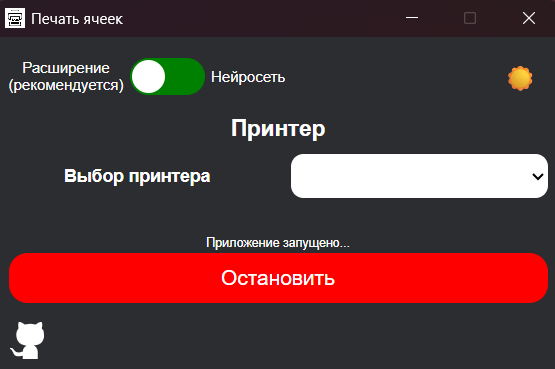
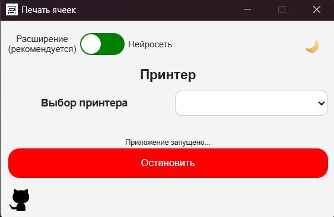

# Печать ячеек

**Печать ячеек** — Windows-приложение для автоматической печати номеров прямо из браузера.

Поддерживаются два режима работы:

* **Расширение для браузера** (рекомендуется) — быстрый и надёжный способ передачи номеров на печать.
* **Распознавание области экрана (Tesseract)** — используется, если расширение недоступно.

---

## Внешний вид

Приложение поддерживает светлую и тёмную темы:

| Светлая тема                 | Тёмная тема                  |
| ---------------------------- | ---------------------------- |
|  |  |

---

## Возможности

* Печать через локальный сервер или напрямую через Tesseract.
* Переключение светлой/тёмной темы.
* Выбор принтера из списка доступных на ПК.
* Сохранение настроек области экрана в `config.json` по пути:

  ```
  %LocalAppData%\\PrintNum
  ```

---

## Требования

* Windows с установленным и настроенным принтером (используется API `win32ui`).

---

## Установка и быстрый старт

1. Скачать MSI-установщик:

   ```
   src-tauri/target/release/bundle/msi/printnum_0.1.0_x64_en-US.msi
   ```
2. Установить и запустить программу `printnum`.
3. Выбрать режим работы:

### Режим «Расширение» (рекомендуется)

1. Открыть страницу:

   ```
   chrome://extensions/
   ```
2. Включить «Режим разработчика» (правый верхний угол).
3. Нажать **«Загрузить распакованное расширение»**.
4. Указать путь:

   ```
   C:\Program Files\PrintNum\extensions\SendNumbersToLocalServer
   ```
5. Обновить вкладки браузера (если они были открыты до установки расширения).

### Режим «Нейросеть»

* Указать область экрана для отслеживания.

---

## Запуск

### Для пользователей

Просто запустите:

```bash
printnum
```

### Для разработчиков

1. Клонировать репозиторий:

   ```bash
   git clone https://github.com/kirill18734/PrintNum.git
   cd PrintNum/backend/
   ```

2. Установить Python 3.10+ с [python.org](https://www.python.org/) (с опцией *Add Python to PATH*).

3. Создать виртуальное окружение и активировать его:

   ```bash
   python -m venv venv
   venv\\Scripts\\activate
   ```

4. Установить зависимости:

   ```bash
   pip install -r requirements.txt
   ```

5. Запустить backend на Python:

   ```bash
   python backend.py
   ```

   или собрать в `.exe` через **auto-py-to-exe**:

   * Script Location: `backend.py`.
   * Icon: `icon.ico`
   * Additional Files: Add-Folder - `Tesseract-OCR`,Add Files -  `data.py`, `print_text.py`, `screen_find_text_neiro.py`.
   
   После компиляции долждна создаться папка output со следующей структурой:

     ```
     output/
     └── backend/
         ├── _internal/
         └── backend.exe
     ```

6. Установить зависимости для Tauri: [tauri.app/start/prerequisites](https://tauri.app/start/prerequisites/).

7. Запустить Tauri в режиме разработки:

   ```bash
   npm run tauri dev
   ```
---

## Структура проекта

* `backend/` — серверная логика (Python).
* `src/` — интерфейс (HTML,CSS,JS).
* `src-tauri/` — конфигурация и сборка Tauri.
