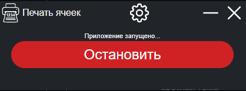
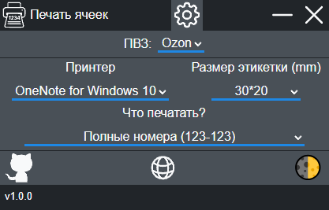

# PrintNum — Печать ячеек Ozon

[](https://github.com/kirill18734/PrintNum/releases)
[](LICENSE)

Windows-приложение для автоматической печати номеров ячеек на складе Ozon. Интегрируется с сайтом Ozon через браузерное расширение, позволяя ускорить процессы выдачи заказов, возвратов и упаковки.


## 📋 Содержание

- [PrintNum — Печать ячеек Ozon](#printnum--печать-ячеек-ozon)
- [Стек технологий](#стек-технологий)
- [🚀 Быстрый старт](#-быстрый-старт)
- [Архитектура](#архитектура)
- [Внешний вид](#внешний-вид)
- [Требования](#требования)
- [Возможности](#возможности)
- [API документация](#api-документация)
- [Разработка](#разработка)
- [Сборка и установка](#сборка-и-установка)
- [Лицензия](#лицензия)
- [Авторы](#авторы)

## Стек технологий

| Компонент     | Технология                          | Описание                          |
|---------------|-------------------------------------|-----------------------------------|
| **Frontend**  | [React](https://reactjs.org/) + TypeScript + Sass | UI с темами и настройками         |
| **Backend**   | [Python](https://www.python.org/) + Flask | API для печати и конфигурации     |
| **Desktop**   | [Tauri](https://tauri.app/) (Rust)  | Кросс-платформенная оболочка      |
| **Extension** | JavaScript + CSS (Manifest V3)      | Интеграция с браузером            |

## 🚀 Быстрый старт

1. **Скачайте MSI-установщик**: Перейдите в раздел [Releases](https://github.com/kirill18734/PrintNum/releases) и скачайте файл `printnum_0.1.0_x64_en-US.zip`.
2. **Установите приложение**: Запустите MSI и следуйте инструкциям.
3. **Запустите PrintNum**: Откройте приложение и нажмите "Запустить".
4. **Настройте параметры**: Перейдите в настройки  и укажите:
   - Принтер из списка доступных.
   - Размер этикетки (ширина/высота).
5. **Установите расширение**:
   - Откройте `chrome://extensions/` в браузере (Yandex, Chrome).
   - Включите "Режим разработчика".
   - Нажмите "Загрузить распакованное расширение".
   - Укажите путь: `%LOCALAPPDATA%\PrintNum\extension` (или найдите через Win + R → `%LOCALAPPDATA%\PrintNum\` → ПКМ по папке extension → "Копировать как путь").
   - Нажмите "Выбор папки".
6. **Обновите вкладки**: Перезагрузите открытые вкладки Ozon.
7. **Готово**: Расширение активно на turbo-pvz.ozon.ru.

## Архитектура

Проект использует модульную архитектуру для разделения ответственности:

- **Frontend (React)**: Управляет UI, темами и пользовательскими настройками. Коммуницирует с backend через HTTP.
- **Backend (Flask)**: Обрабатывает запросы на печать, управляет конфигурацией и взаимодействует с Windows API для принтеров.
- **Desktop (Tauri)**: Обеспечивает нативную оболочку, автообновления и интеграцию с ОС.
- **Extension**: Инжектирует скрипты в страницы Ozon для захвата номеров и отправки их на backend.

```
[Браузерное расширение] → [Backend API] → [Печать на принтере]
                          ↓
[Desktop UI (React)] ←→ [Backend] ←→ [Конфиг (JSON)]
```

## Внешний вид

[(Вернуться к началу)](#printnum--печать-ячеек-ozon)

<table>
  <thead>
    <tr>
      <th>Светлая тема</th>
      <th>Тёмная тема</th>
    </tr>
  </thead>
  <tbody>
    <tr>
      <td colspan="2" style="font-weight: bold; text-align: center;">Главная страница</td>
    </tr>
    <tr>
      <td></td>
      <td></td>
    </tr>
    <tr>
      <td colspan="2" style="font-weight: bold; text-align: center;">Настройки</td>
    </tr>
    <tr>
      <td></td>
      <td></td>
    </tr>
  </tbody>
</table>

## Требования

[(Вернуться к началу)](#printnum--печать-ячеек-ozon)

- **ОС**: Windows 8+ (x64).
- **Браузер**: Chrome или Yandex Browser с поддержкой Manifest V3.
- **Python**: 3.10+ (для разработки).
- **Node.js**: 18+ (для сборки frontend).
- **Rust**: Для Tauri (устанавливается автоматически через CLI).

## Возможности

[(Вернуться к началу)](#printnum--печать-ячеек-ozon)

### Возможности приложения

- 🌙 Переключение светлой/тёмной темы.
- 🖨️ Выбор принтера из списка доступных на ПК.
- 📏 Настройка размера этикетки (ширина/высота).
- 🔤 Выбор формата печати текста.
- 🔄 Автоматические обновления через Tauri.

### Возможности расширения

- **Скрытие элементов** (отключено по умолчанию): Включите в `extension/index.js` (`ENABLE_FEATURE = true`). Добавляет кнопку 🎁 в левом нижнем углу для скрытия меню, возвратов и уведомлений.
- **Печать номеров ячеек**: Автоматическая отправка номеров на печать.
- **QR-коды для ускорения** (см. `qrcodeOzon.docx`):
  - Автозакрытие карточек выдачи (для предоплаченных/неоплаченных заказов).
  - Оформление возвратов.
  - Ускорение упаковки в разделе "Отправка перевозок".

## API документация

Backend предоставляет REST API на Flask. Все эндпоинты поддерживают CORS.

- **POST /firstRun**: Инициализация. Возвращает конфиг и список принтеров.
  - Ответ: `{"config": {...}, "printers": [...]}`
- **POST /statePrinter**: Статус принтера.
  - Ответ: `{"state": "OK" | "ERROR"}`
- **POST /set_config**: Сохранение настроек.
  - Тело: JSON с обновлениями.
  - Ответ: `{"update_config": "OK"}`
- **POST /print_number**: Печать номера.
  - Тело: Строка с номером.
  - Ответ: `{"status": "printed"}` (или ошибка).

Сервер запускается на `http://localhost:5000` по умолчанию.

## Разработка

[(Вернуться к началу)](#printnum--печать-ячеек-ozon)

1. **Клонируйте репозиторий**:
   ```bash
   git clone https://github.com/kirill18734/PrintNum.git
   cd PrintNum
   ```

2. **Настройте backend**:
   - Установите Python 3.10+ с [python.org](https://www.python.org/) (добавьте в PATH).
   - Создайте виртуальное окружение:
     ```bash
     python -m venv .venv
     .venv\Scripts\activate  # Windows
     ```
   - Установите зависимости:
     ```bash
     pip install -r backend/requirements.txt
     ```
   - Запустите сервер:
     ```bash
     python backend/backend.py
     ```

3. **Настройте frontend**:
   - Установите Node.js 18+.
   - Установите зависимости:
     ```bash
     npm install
     ```
   - Запустите dev-сервер:
     ```bash
     npm run dev
     ```

4. **Запустите Tauri**:
   - Установите prerequisites: [tauri.app/start/prerequisites](https://tauri.app/start/prerequisites/).
   - Запустите в режиме разработки:
     ```bash
     npm run tauri dev
     ```

5. **Тестируйте расширение**:
   - Загрузите `extension/` как распакованное в `chrome://extensions/`.

## Сборка и установка

[(Вернуться к началу)](#printnum--печать-ячеек-ozon)

- **Backend в EXE**: Используйте auto-py-to-exe с `backend.py` как основным скриптом, добавьте `data.py`, `print_text.py`, `utils.py` как дополнительные файлы.
- **Полная сборка**: `npm run tauri build` создаст MSI-инсталлятор в `src-tauri/target/release/bundle/nsis/`.
- **Установка**: Запустите MSI. Расширение и backend будут скопированы автоматически.

## Структура проекта

```
PrintNum/
├── backend/              # Python Flask сервер
│   ├── backend.py        # Основной сервер
│   ├── data.py           # Управление конфигом
│   ├── print_text.py     # Логика печати
│   ├── utils.py          # Утилиты (принтеры, форматирование)
│   └── requirements.txt  # Зависимости Python
├── extension/            # Браузерное расширение
│   ├── manifest.json     # Конфиг расширения
│   ├── index.js          # Основной скрипт
│   └── ...               # Дополнительные скрипты/CSS
├── src/                  # React frontend
│   ├── App.tsx           # Главный компонент
│   ├── components/       # UI компоненты
│   └── ...
├── src-tauri/            # Tauri конфиг и Rust код
│   ├── tauri.conf.json   # Конфигурация
│   └── src/              # Rust код
├── public/               # Статические ресурсы
└── package.json          # Зависимости Node.js
```

## Лицензия

Этот проект распространяется под лицензией MIT. См. [LICENSE](LICENSE) для деталей.

## Авторы

[(Вернуться к началу)](#printnum--печать-ячеек-ozon)

- **Кирилл** — Разработчик. [Telegram](https://web.telegram.org/k/#@ASPIRhigher)

Если у вас есть вопросы или предложения, создайте Issue в репозитории!
