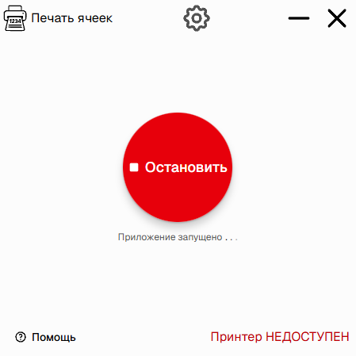
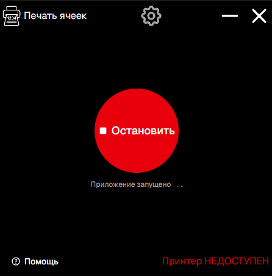
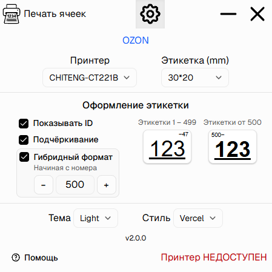
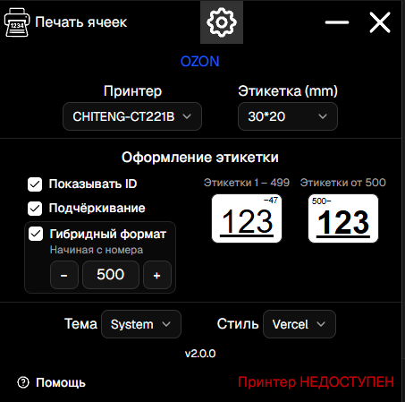

# PrintNum — Печать ячеек (Ozon)

Windows-приложение для автоматической печати номеров ячеек на складе Ozon. Интегрируется с сайтом Ozon через браузерное расширение, позволяя ускорить процессы приемки, выдачи заказов, возврат товаров и упаковки.

## 📋 Содержание

- [PrintNum — Печать ячеек Ozon](#printnum--печать-ячеек-ozon)
- [🚀 Быстрый старт](#-быстрый-старт)
- [Стек технологий](#стек-технологий)
- [Архитектура](#архитектура)
- [Внешний вид](#внешний-вид)
- [Требования](#требования)
- [Возможности](#возможности)
- [API документация](#api-документация)
- [Разработка](#разработка)
- [Сборка и установка](#сборка-и-установка)
- [Структура проекта](#структура-проекта)
- [Авторы](#авторы)

## 🚀 Быстрый старт

[(Вернуться к началу)](#printnum--печать-ячеек-ozon)

1. **Скачайте MSI-установщик**: Перейдите в раздел [Releases](https://github.com/kirill18734/PrintNum/releases) и скачайте последний доступный инсталлятор.
2. **Установите приложение**: Запустите MSI и следуйте инструкциям.
3. **Запустите PrintNum**: Откройте приложение из меню "Пуск" или ярлыка на рабочем столе.
4. **Настройте параметры**:
   - **Принтер**: выберите доступный принтер Windows.
   - **Размер этикетки**: задайте ширину и высоту.
   - **Стиль этикетки**: настройте формат текста и расположение.
5. **Установите расширение** (см. [подробности](https://github.com/kirill18734/PrintNum/tree/main/extension)):
   - Откройте `chrome://extensions/` в браузере (Yandex, Chrome).
   - Включите "Режим разработчика".
   - Найдите папку, в которой находится основной `.exe` файл программы, и скопируйте путь к этой папке.
     (см. [Как открыть расположение исполняемого EXE файла программы в Windows](https://remontka.pro/open-exe-file-location-windows)).
   - Внутри этой же директории находится папка `extension` — именно её нужно выбрать для установки.
   - Нажмите "Загрузить распакованное расширение"
   - Выберите папку `extension`.
6. **Перезагрузите страницы Ozon**.
7. **Готово**: теперь расширение автоматически передает номера ячеек в программу PrintNum на вашем компьютере.

## Стек технологий

[(Вернуться к началу)](#printnum--печать-ячеек-ozon)

| Компонент     | Технология                                                                                                                               | Описание                      |
| ------------- | ---------------------------------------------------------------------------------------------------------------------------------------- | ----------------------------- |
| **Frontend**  | [React](https://react.dev/) 19 + [TypeScript](https://www.typescriptlang.org/) 5.8 + [Tailwind CSS](https://tailwindcss.com/) 4.3 + Vite | UI приложения                 |
| **Backend**   | [Python](https://www.python.org/) 3.10+ + [Flask](https://flask.palletsprojects.com/) 3.1 + [pywin32](https://github.com/pywin/pywin32)  | API для печати и конфигурации |
| **Desktop**   | [Tauri](https://tauri.app/) 2 (Rust 2021)                                                                                                | Десктопная оболочка Windows   |
| **Extension** | [WXT](https://wxt.dev/) + React 18 + TypeScript                                                                                          | Браузерное расширение Ozon    |

## Архитектура

[(Вернуться к началу)](#printnum--печать-ячеек-ozon)

Проект использует модульную архитектуру для разделения ответственности между четырьмя основными компонентами:

### 🎨 **Frontend (React)**

- Управляет пользовательским интерфейсом и настройками приложения.
- Коммуницирует с backend через HTTP-запросы.
- Отвечает за темы, стили этикеток и сохранение конфигурации.

### 🔧 **Backend (Flask + Python)**

- Запускает REST API сервер для обработки запросов на печать.
- Читает конфигурацию.
- Проверяет состояние принтера и отправляет текст на печать.
- Завершается автоматически после 10 секунд неактивности.

### 📱 **Desktop (Tauri + Rust)**

- Обеспечивает нативную оболочку приложения для Windows.
- Запускает backend-процесс при старте.
- Поддерживает автообновления и системные диалоги.

### 🌐 **Браузерное расширение (WXT + React + TypeScript)**

- Работает на страницах Ozon и отправляет номера ячеек в программу PrintNum на ПК.
- Автоматизирует процессы выдачи, приемку, возврат товаров и упаковку.
- Скрывает элементы интерфейса и управляет поведением страницы.

```
Пользователь                    Ozon сайт
   ↓                               ↓
 Desktop UI ────────────→ Расширение
   ↓                               ↓
 React-Router                 Content Scripts
   ↓                               ↓
[API Client] ←──────────────[fetch request]
   ↓                               ↓
 Flask Backend
   ↓
[Windows API - Принтер]
   ↓
  📄 Печать этикетки
```

## Внешний вид

[(Вернуться к началу)](#printnum--печать-ячеек-ozon)

<table>
  <thead>
    <tr>
      <th>Светлая тема</th>
      <th>Тёмная тема</th>
    </tr>
  </thead>
  <tbody>
    <tr>
      <td colspan="2" style="font-weight: bold; text-align: center;">Главная страница</td>
    </tr>
    <tr>
      <td></td>
      <td></td>
    </tr>
    <tr>
      <td colspan="2" style="font-weight: bold; text-align: center;">Настройки</td>
    </tr>
    <tr>
      <td></td>
      <td></td>
    </tr>
  </tbody>
</table>

## Требования

[(Вернуться к началу)](#printnum--печать-ячеек-ozon)

- **ОС**: Windows 8+ x64 — требуется для работы печати и Tauri.
- **Браузер**: Chromium-совместимый браузер (Chrome, Yandex, Edge).
- **Python**: 3.10+ для backend-разработки.
- **Node.js**: 18+ LTS для frontend, extension и Tauri.
- **Rust**: 1.70+ для сборки Tauri-приложения.
- **Python-зависимости**: Flask, flask-cors, pywin32.

## Возможности

[(Вернуться к началу)](#printnum--печать-ячеек-ozon)

### Возможности приложения

- 🖨️ **Выбор принтера**: Автоматически находит принтеры, подключенные к вашему компьютеру.
- 📏 **Настройка этикетки**: Задаёт ширину, высоту и формат текста.
- 🔤 **Форматирование текста**: добавление ID/подчеркивание, гибридный режим.
- 🌙 **Темы оформления**: Поддержка светлой и тёмной темы.
- 🎨 **Пользовательские параметры**: Управление внешним видом и шаблонами печати.
- 🔄 **Автообновления**: Механизм обновления через Tauri.
- 💾 **Сохранение конфигурации**: Все параметры сохраняются и восстанавливаются при запуске.

### Возможности расширения

[(Вернуться к началу)](#printnum--печать-ячеек-ozon)

см. [Документация расширения](https://github.com/kirill18734/PrintNum/tree/main/extension)

## API документация

[(Вернуться к началу)](#printnum--печать-ячеек-ozon)

Backend предоставляет REST API на Flask на порту `5000`.

| Метод    | Эндпоинт          | Описание                     | Ответ                            |
| -------- | ----------------- | ---------------------------- | -------------------------------- |
| **GET**  | `/`               | Проверка доступности сервера | `{"status": true}`               |
| **GET**  | `/status-printer` | Проверка состояния принтера  | `{"printerOnline": true/false}`  |
| **GET**  | `/listPrinters`   | Получение списка принтеров   | `{"listPrinters": ["Принтер1"]}` |
| **POST** | `/print-number`   | Печать номера ячейки         | `OK`                             |

**Базовый URL**: `http://127.0.0.1:5000`

**Автозавершение**: сервер автоматически завершается через 10 секунд неактивности (watchdog).

## Разработка

[(Вернуться к началу)](#printnum--печать-ячеек-ozon)

1. **Клонируйте репозиторий**:

   ```bash
   git clone https://github.com/kirill18734/PrintNum.git
   cd PrintNum
   ```

2. **Настройте backend**:
   - Установите Python 3.10+ с [python.org](https://www.python.org/) (добавьте в PATH).
   - Перейдите в папку `backend`:
     ```bash
     cd backend
     ```
   - Создайте виртуальное окружение:
     ```bash
     python -m venv .venv
     .venv\Scripts\activate  # Windows
     ```
   - Установите зависимости:
     ```bash
     pip install -r requirements.txt
     ```
   - Запустите сервер:
     ```bash
     python backend.py
     ```
   - Сервер запустится на `http://localhost:5000`

3. **Настройте frontend** (в корне проекта):
   - Убедитесь, что Node.js 18+ установлен.
   - Установите зависимости:
     ```bash
     npm install
     ```
   - Запустите dev-сервер Vite:
     ```bash
     npm run dev
     ```
   - Frontend откроется на `http://localhost:5173`

4. **Запустите Tauri** (нативное приложение):
   - Установите prerequisites для вашей ОС: [tauri.app/start/prerequisites](https://tauri.app/start/prerequisites/)
   - В корне проекта запустите:
     ```bash
     npm run tauri dev
     ```
   - Откроется окно приложения с HMR (hot-reload)

5. **Тестируйте расширение**:
   см. [Документация расширения](https://github.com/kirill18734/PrintNum/tree/main/extension)

## Сборка и установка

[(Вернуться к началу)](#printnum--печать-ячеек-ozon)

- **Backend в EXE**: Используйте [auto-py-to-exe](https://github.com/brentyi/auto-py-to-exe):
  1. Откройте auto-py-to-exe в папке `backend/`
  2. Выберите `backend.py` как основной скрипт
  3. Добавьте как Icons: `icon.ico` [опционально]
  4. Добавьте как "Additional files": `data.py`, `print_text.py`, `utils.py`
  5. Build → готовый EXE будет в `backend/output/backend/`
- **Полная сборка приложения**:

  ```bash
  npm run build       # Сборка frontend
  npm run tauri build # Сборка Tauri (создаст MSI)
  ```

  MSI-инсталлятор будет в `src-tauri/target/release/bundle/nsis/`

- **Установка через MSI**: Запустите `.msi` файл. Приложение установится с расширением и backend'ом.

## Структура проекта

[(Вернуться к началу)](#printnum--печать-ячеек-ozon)

```
PrintNum/
├── .gitignore
├── .vscode/                      # Настройки редактора
├── DriverPrinter_CHITENG-CT221B.exe  # Внимание: драйвер для Термопринтера CHITENG-CT221B
├── backend/                      # Python Flask сервер и логика печати
│   ├── backend.py               # Запуск API сервера
│   ├── data.py                  # Чтение/запись конфигурации
│   ├── print_text.py            # Алгоритм печати на Windows
│   ├── utils.py                 # Утилиты принтера и статус
│   ├── requirements.txt         # Python зависимости
│   ├── get.http                 # Примеры GET-запросов
│   ├── post.http                # Примеры POST-запросов
│   └── icon.ico                 # Иконка приложения для backend
├── extension/                   # WXT расширение для Ozon
│   ├── package.json             # Зависимости расширения
│   ├── package-lock.json        # Фиксация зависимостей Node
│   ├── pnpm-lock.yaml           # Фиксация зависимостей pnpm
│   ├── wxt.config.ts            # Конфигурация WXT сборки
│   ├── tailwind.config.js       # Конфиг Tailwind
│   ├── tsconfig.json            # TypeScript конфигурация
│   ├── README.md                # Документация расширения
│   ├── src/
│   │   ├── entrypoints/         # Content scripts и popup
│   │   ├── components/          # Компоненты UI
│   │   ├── hooks/
│   │   ├── lib/
│   │   ├── utils/
│   │   └── public/              # Статические ресурсы расширения
│   ├── components.json          # WXT компоненты
│   ├── eslint.config.js         # ESLint правила
│   └── postcss.config.js        # PostCSS для Tailwind
├── public/                      # Статические ассеты приложения
│   ├── favicon.ico
│   ├── light/
│   └── dark/
├── src/                         # React интерфейс Tauri приложения
│   ├── index.tsx
│   ├── layout.tsx
│   ├── components/
│   ├── config/
│   ├── context/
│   ├── hooks/
│   ├── lib/
│   ├── pages/
│   ├── services/
│   └── styles/
├── src-tauri/                   # Tauri и Rust приложение
│   ├── Cargo.toml               # Rust зависимости и сборка
│   ├── Cargo.lock               # Зафиксированные версии Rust
│   ├── tauri.conf.json          # Настройки Tauri приложения
│   ├── build.rs                 # Скрипт сборки
│   ├── capabilities/
│   ├── icons/
│   └── src/
│       ├── main.rs
│       └── lib.rs
├── index.html                   # Точка входа веб-приложения
├── latest.json                  # Информация о последнем релизе
├── package.json                 # Node.js зависимости и скрипты
├── package-lock.json            # Зафиксированные версии npm
├── privateKey.txt               # Внимание: ключ подписи обновлений
├── README.md                    # Документация проекта
├── tsconfig.json                # TypeScript конфигурация
├── tsconfig.node.json           # Конфиг для Node/сборки
└── vite.config.ts               # Конфигурация Vite
```

## Авторы

[(Вернуться к началу)](#printnum--печать-ячеек-ozon)

- **Кирилл** — Разработчик. По всем вопросам можно связаться в Telegram (@ASPIRhigher)
