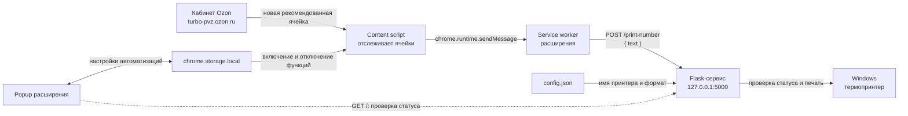

# PrintNum

Это ветка `core` репозитория PrintNum, содержащая исходное ядро приложения для продвинутых пользователей. Она предполагает ручную установку и настройку: здесь нет графического интерфейса для установки или управления сервисом печати.

Для готовой и более удобной версии с интерфейсом перейдите в ветку [main](https://github.com/kirill18734/printnum/tree/main) этого же репозитория.

Ядро печатает номера ячеек из личного кабинета пункта выдачи Ozon (`turbo-pvz.ozon.ru`) на локальный термопринтер. В репозитории две части:

- `backend/` - локальный Flask-сервис, который форматирует и отправляет текст на Windows-принтер;
- `extension/` - Chrome-расширение для отслеживания рекомендуемой ячейки и дополнительных автоматизаций интерфейса Ozon.

## Требования

- Windows с установленным и доступным в системе принтером;
- Python 3.10 или новее;
- Google Chrome или другой браузер на базе Chromium;
- доступ к `https://turbo-pvz.ozon.ru/`.

Backend использует `pywin32`, поэтому запуск печати на Linux и macOS не поддерживается.

## Полный цикл: от клонирования до первой печати

1. Скачайте и установите Git for Windows с [git-scm.com](https://git-scm.com/download/win). В установщике оставьте настройки по умолчанию.
2. Откройте PowerShell и проверьте установку Git:

  ```powershell
  git --version
  ```

3. Перейдите в папку, где будет храниться проект, и склонируйте ветку `core`:

  ```powershell
  cd "$HOME\Documents"
  git clone --branch core https://github.com/kirill18734/printnum.git PrintNum
  cd .\PrintNum
  ```

4. Скачайте установщик Python 3.10 или новее для Windows с [python.org/downloads](https://www.python.org/downloads/windows/).
5. Запустите установщик. На первом экране обязательно включите пункт **Add python.exe to PATH**, затем нажмите **Install Now**.
6. После завершения установки закройте и снова откройте PowerShell. Проверьте установку:

  ```powershell
  python --version
  pip --version
  ```

  Обе команды должны вывести версию. Если PowerShell сообщает, что `python` не найден, перезапустите компьютер или переустановите Python, включив опцию добавления в `PATH`.
7. Вернитесь в папку проекта и откройте каталог backend:

  ```powershell
  cd "$HOME\Documents\PrintNum\backend"
  ```

8. Создайте изолированное окружение для зависимостей и активируйте его:

  ```powershell
  python -m venv .venv
  .\.venv\Scripts\Activate.ps1
  ```

  Если PowerShell запретил выполнение скрипта, разрешите его только для текущего окна и повторите активацию:

  ```powershell
  Set-ExecutionPolicy -Scope Process -ExecutionPolicy Bypass
  .\.venv\Scripts\Activate.ps1
  ```

  В начале командной строки появится `(.venv)`.
9. Установите зависимости проекта:

  ```powershell
  python -m pip install --upgrade pip
  pip install -r requirements.txt
  ```

10. Откройте `config.json` в текстовом редакторе и укажите точное имя установленного Windows-принтера в поле `printer`. Остальные параметры описаны в разделе «Настройка принтера».
11. Запустите сервис, не закрывая это окно PowerShell:

  ```powershell
  python backend.py
  ```

Сервис запускается на `http://127.0.0.1:5000`. Проверить его доступность можно командой:

```powershell
Invoke-RestMethod http://127.0.0.1:5000/
```

Ожидаемый ответ:

```json
{"status":"ok"}
```

12. Для первой тестовой печати откройте второе окно PowerShell и отправьте номер ячейки:

  ```powershell
  Invoke-RestMethod -Method Post -Uri http://127.0.0.1:5000/print-number -ContentType "application/json" -Body '{"text":"500-1"}'
  ```

  Сервис вернёт `OK`, а на выбранном принтере должна появиться этикетка. Остановить сервис можно в первом окне сочетанием `Ctrl+C`.

Важно: запускайте `backend.py` именно из каталога `backend`, так как файл настроек ищется как `config.json` в текущей рабочей директории.

## Настройка принтера

Перед запуском укажите имя принтера в `backend/config.json`:

```json
{
  "endLine": false,
  "printer": "Имя принтера из Windows",
  "hybrid": false,
  "idNum": false,
  "paper": "30*20",
  "expand": 500
}
```

| Параметр | Описание |
| --- | --- |
| `printer` | Точное имя принтера из настроек Windows. |
| `paper` | Размер этикетки в миллиметрах в формате `ширина*высота`, например `30*20`. |
| `endLine` | Подчёркивает основной текст. Если `false`, к нему добавляется точка. |
| `idNum` | Показывает часть номера после дефиса в заголовке. |
| `hybrid` | Включает специальное форматирование для числовых ячеек от `expand`. |
| `expand` | Порог для специального форматирования при включённом `hybrid`. |

Для обычной строки `500-1` основным текстом будет `500`, а при `idNum: true` в заголовке печатается `-1`. Для КГТ (`КГТ-23`) и для числовых значений, достигших порога в гибридном режиме, части строки меняются местами, а основной текст печатается жирным.

Каждая печать предварительно очищает очередь заданий выбранного принтера.

## Установка расширения

Расширение не обязательно устанавливать из локальной папки. Откройте его страницу в [Chrome Web Store](https://chromewebstore.google.com/detail/printnum-%D0%BF%D0%B5%D1%87%D0%B0%D1%82%D1%8C-%D1%8F%D1%87%D0%B5%D0%B5%D0%BA-ozo/pebpcdibpeodhdkbeniijidffpfpiagn) или найдите **«PrintNum - Печать Ячеек (Ozon)»** через поиск магазина. Нажмите **Установить** и подтвердите установку.

Локальная установка требуется только для разработки или проверки изменений в этой ветке:

1. Откройте `chrome://extensions`.
2. Включите режим разработчика.
3. Нажмите **Загрузить распакованное расширение**.
4. Выберите каталог `extension` в склонированном проекте.

После любого способа установки запустите сервис печати и откройте `https://turbo-pvz.ozon.ru/`.

В popup расширения отображается статус локального сервиса. На странице рекомендаций (`/receiving-v2/main`) расширение отслеживает изменение рекомендованной ячейки и отправляет первый новый номер в сервис печати.

## Возможности расширения

- Печать рекомендуемой ячейки через локальный API.
- QR-обработчики для выдачи, оплаты, выбора пакета M/L и рекомендаций. Они выключены по умолчанию.
- Автоскрипты: выбор причины «Упаковки Ozon нет в наличии» и перенос тарников в перевозку. Они выключены по умолчанию.
- Управление видимостью пунктов меню, уведомлений, возвратов и баннеров Ozon через popup.
- Встроенная памятка QR-кодов: `extension/qrCodes.pdf`.

Состояние переключателей сохраняется в `chrome.storage.local`. Новые QR-обработчики и автоскрипты после обновления расширения также добавляются выключенными.

## Схема работы


```mermaid
flowchart LR
  O["Кабинет Ozon<br/>turbo-pvz.ozon.ru"]
  C["Content script<br/>отслеживает ячейки"]
  B["Service worker<br/>расширения"]
  A["Flask-сервис<br/>127.0.0.1:5000"]
  P["Windows<br/>термопринтер"]
  U["Popup расширения"]
  S["chrome.storage.local"]
  F["config.json"]

  O -->|"новая рекомендованная ячейка"| C
  C -->|"chrome.runtime.sendMessage"| B
  B -->|"POST /print-number<br/>{ text }"| A
  F -->|"имя принтера и формат"| A
  A -->|"проверка статуса и печать"| P
  U <-->|"настройки автоматизаций"| S
  S -->|"включение и отключение функций"| C
  U -.->|"GET /: проверка статуса"| A
```

1. Пользователь открывает кабинет Ozon. Content script расширения работает только на страницах `https://turbo-pvz.ozon.ru/`.
2. На странице рекомендаций расширение наблюдает за изменениями списка ячеек. При первом запуске оно только запоминает уже показанные значения, чтобы не напечатать старую рекомендацию.
3. Когда список меняется, расширение берёт первую новую ячейку и передаёт её фоновому service worker. Тот отправляет `POST`-запрос с JSON-объектом `{ "text": "номер ячейки" }` на `http://127.0.0.1:5000/print-number`.
4. Flask-сервис получает запрос, перечитывает `config.json` при изменении файла и проверяет, что указанный Windows-принтер доступен. Если принтер недоступен, сервис выводит сообщение в консоль и не создаёт задание печати.
5. Для доступного принтера сервис очищает его очередь, разбирает текст ячейки, подбирает размер шрифта под размеры этикетки и передаёт документ в Windows Print Spooler. Настройки `paper`, `endLine`, `idNum`, `hybrid` и `expand` влияют на оформление этикетки.
6. Popup расширения запрашивает `GET /`, чтобы показать, запущен ли локальный сервис. Там же включаются QR-обработчики, автоскрипты и настройки видимости. Их состояние хранится локально в браузере в `chrome.storage.local` и применяется content scripts при работе сайта.

Сервис и браузерное расширение должны работать на одном компьютере: адрес `127.0.0.1` всегда указывает на текущий компьютер. Расширение не сможет отправить задание на принтер, если локальный Flask-сервис не запущен.

## API

### `GET /`

Проверяет доступность сервиса.

### `POST /print-number`

Отправляет текст на печать. Заголовок `Content-Type` должен иметь значение `application/json`.

```http
POST http://127.0.0.1:5000/print-number
Content-Type: application/json

{
  "text": "500-1"
}
```

Примеры запросов для REST Client находятся в `backend/post.http`.

## Структура

```text
backend/     Flask-сервис, настройка принтера и код печати
extension/   Manifest V3-расширение Chromium
```

## Разработка

В репозитории нет настроенного тестового набора. Для ручной проверки запустите backend, отправьте запрос из `backend/post.http` и убедитесь, что задание появилось на нужном принтере. После изменения файлов расширения обновите его на странице `chrome://extensions`.