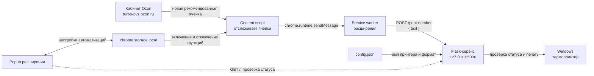

# PrintNum

Это ветка `core` репозитория PrintNum, содержащая исходное ядро приложения для продвинутых пользователей. Она предполагает ручную установку и настройку: здесь нет графического интерфейса для установки или управления сервисом печати.

Отдельного интерфейса для настройки backend здесь нет: параметры сервиса задаются вручную в `backend/config.json`. Popup расширения показывает состояние сервиса и содержит ссылку на загрузку приложения для Windows. Для готовой и более удобной версии с интерфейсом перейдите в ветку [main](https://github.com/kirill18734/printnum/tree/main) этого же репозитория.

Ядро печатает номера ячеек из личного кабинета пункта выдачи Ozon (`turbo-pvz.ozon.ru`) на локальный термопринтер. В репозитории две части:

- `backend/` - локальный Flask-сервис, который форматирует и отправляет текст на Windows-принтер;
- `extension/` - Chrome-расширение для отслеживания рекомендуемой ячейки и дополнительных автоматизаций интерфейса Ozon.

## Требования

- Windows с установленным и доступным в системе принтером;
- Python 3.10 или новее;
- Google Chrome или другой браузер на базе Chromium;
- доступ к `https://turbo-pvz.ozon.ru/`.

Backend использует `pywin32`, поэтому запуск печати на Linux и macOS не поддерживается.

## Полный цикл: от клонирования до первой печати

1. Скачайте и установите Git for Windows с [git-scm.com](https://git-scm.com/download/win). В установщике оставьте настройки по умолчанию.
2. Откройте PowerShell и проверьте установку Git:

```powershell
git --version
```

3. Перейдите в папку, где будет храниться проект, и склонируйте ветку `core`:

```powershell
cd "$HOME\Documents"
git clone --branch core https://github.com/kirill18734/printnum.git PrintNum
cd .\PrintNum
```

4. Скачайте установщик Python 3.10 или новее для Windows с [python.org/downloads](https://www.python.org/downloads/windows/).
5. Запустите установщик. На первом экране обязательно включите пункт **Add python.exe to PATH**, затем нажмите **Install Now**.
6. После завершения установки закройте и снова откройте PowerShell. Проверьте установку:

```powershell
python --version
pip --version
```

Обе команды должны вывести версию. Если PowerShell сообщает, что `python` не найден, перезапустите компьютер или переустановите Python, включив опцию добавления в `PATH`. 7. Вернитесь в папку проекта и откройте каталог backend:

```powershell
cd "$HOME\Documents\PrintNum\backend"
```

8. Создайте изолированное окружение для зависимостей и активируйте его:

```powershell
python -m venv .venv
.\.venv\Scripts\Activate.ps1
```

Если PowerShell запретил выполнение скрипта, разрешите его только для текущего окна и повторите активацию:

```powershell
Set-ExecutionPolicy -Scope Process -ExecutionPolicy Bypass
.\.venv\Scripts\Activate.ps1
```

В начале командной строки появится `(.venv)`. 9. Установите зависимости проекта:

```powershell
python -m pip install --upgrade pip
pip install -r requirements.txt
```

10. Откройте `config.json` в текстовом редакторе и укажите точное имя установленного Windows-принтера в поле `printer`. Остальные параметры описаны в разделе «Настройка принтера».
11. Запустите сервис, не закрывая это окно PowerShell:

```powershell
python backend.py
```

Сервис запускается на `http://127.0.0.1:5000`. Проверить его доступность можно командой:

```powershell
Invoke-RestMethod http://127.0.0.1:5000/
```

Ожидаемый ответ:

```json
{ "status": "ok" }
```

12. Для первой тестовой печати откройте второе окно PowerShell и отправьте номер ячейки:

```powershell
Invoke-RestMethod -Method Post -Uri http://127.0.0.1:5000/print-number -ContentType "application/json" -Body '{"text":"500-1"}'
```

Если принтер доступен, на нём должна появиться этикетка. При недоступном принтере сервис также возвращает `OK`, но выводит сообщение в окно PowerShell и не отправляет задание на печать. Остановить сервис можно в первом окне сочетанием `Ctrl+C`.

Важно: запускайте `backend.py` именно из каталога `backend`, так как файл настроек ищется как `config.json` в текущей рабочей директории.

## Настройка принтера

Перед запуском укажите имя принтера в `backend/config.json`:

```json
{
  "endLine": false,
  "printer": "Имя принтера из Windows",
  "hybrid": false,
  "idNum": false,
  "paper": "30*20",
  "expand": 500
}
```

| Параметр  | Описание                                                                   |
| --------- | -------------------------------------------------------------------------- |
| `printer` | Точное имя принтера из настроек Windows.                                   |
| `paper`   | Размер этикетки в миллиметрах в формате `ширина*высота`, например `30*20`. |
| `endLine` | Подчёркивает основной текст. Если `false`, к нему добавляется точка.       |
| `idNum`   | Показывает часть номера после дефиса в заголовке.                          |
| `hybrid`  | Включает специальное форматирование для числовых ячеек от `expand`.        |
| `expand`  | Порог для специального форматирования при включённом `hybrid`.             |

Для обычной строки `500-1` основным текстом будет `500`, а при `idNum: true` в заголовке печатается `-1`. Для КГТ (`КГТ-23`) части строки всегда меняются местами, а основной текст печатается жирным независимо от `hybrid`. Для числовых ячеек это форматирование включается, когда `hybrid: true` и значение достигает порога `expand`.

Каждая печать предварительно очищает очередь заданий выбранного принтера.

## Установка расширения

Расширение не обязательно устанавливать из локальной папки. Откройте его страницу в [Chrome Web Store](https://chromewebstore.google.com/detail/printnum-%D0%BF%D0%B5%D1%87%D0%B0%D1%82%D1%8C-%D1%8F%D1%87%D0%B5%D0%B5%D0%BA-ozo/pebpcdibpeodhdkbeniijidffpfpiagn) или найдите **«PrintNum - Печать Ячеек (Ozon)»** через поиск магазина. Нажмите **Установить** и подтвердите установку.

Локальная установка требуется только для разработки или проверки изменений в этой ветке:

1. Откройте `chrome://extensions`.
2. Включите режим разработчика.
3. Нажмите **Загрузить распакованное расширение**.
4. Выберите каталог `extension` в склонированном проекте.

После любого способа установки запустите сервис печати и откройте `https://turbo-pvz.ozon.ru/`.

В popup расширения отображается статус локального сервиса. На странице рекомендаций (`/receiving-v2/main`) расширение запоминает показанные ячейки при первом запуске, не отправляя их на печать. Когда список меняется, в сервис передаётся первая ячейка нового списка.

## Возможности расширения

Откройте popup нажатием на иконку PrintNum в панели браузера. В разделе **Дополнительные возможности** находятся QR-команды, автоскрипты и настройки видимости. Нажмите на нужный раздел и включите переключатель конкретной функции. QR-команды и автоскрипты по умолчанию выключены; настройки видимости применяются сразу или при следующем переходе по сайту Ozon.

### Автоматическая печать ячеек

На странице «Приёмка» расширение запоминает исходный список ячеек без печати. При изменении списка оно передаёт первую ячейку нового списка в локальный сервис печати. Чтобы функция работала, Flask-сервис должен быть запущен, а в `config.json` должно быть указано имя доступного принтера.

### QR-команды

Перед использованием включите нужные команды в popup. QR-коды можно распечатать для удобства через кнопку печати в разделе QR-команд; файл также находится в `extension/qrCodes.pdf`.

#### Выдать заказ (без пакета / M / L)

Раздел, где сработает QR-код:

```text
Выдача заказов → Открытая карточка для выдачи
```

После сканирования QR-кода расширение выполняет следующие действия:

1. Выбирает пакет, если отсканирован вариант с пакетом M или L.
2. Нажимает «Выдать».

Скрипт не проверяет статус оплаты заказа: он выполняет действие, только если соответствующая кнопка доступна на странице.

#### Выдать всё (без пакета / M / L)

Раздел, где сработает QR-код:

```text
Выдача заказов
```

После сканирования QR-кода расширение выполняет следующие действия для каждого заказа:

1. Нажимает «К выдаче».
2. Выбирает пакет, если отсканирован вариант с пакетом M или L.
3. Нажимает «Выдать».

Цепочка повторяется с паузой в одну секунду, пока кнопки доступны, но не более 50 раз. Если один из ожидаемых элементов не найден, скрипт останавливается.

#### Оплатить заказ (без пакета / M / L)

Раздел, где сработает QR-код:

```text
Выдача заказов → Открытая карточка для выдачи
```

После сканирования QR-кода расширение выполняет следующие действия:

1. Выбирает пакет, если отсканирован вариант с пакетом M или L.
2. Нажимает «Провести оплату».

Если кнопка «Провести оплату» или нужный вариант пакета не найден, выполнение прекращается. Повторная попытка через «Попробовать ещё» в этой ветке не реализована.

#### Автоматический выбор упаковки

Для выдачи всех заказов, выдачи одного заказа и оплаты заказа доступны отдельные QR-команды с пометкой «(авто)». При каждом запуске они по очереди выбирают вариант без пакета, M, L, затем начинают цикл заново. Порядок общий для этих команд и сохраняется в хранилище браузера. Для команды «Выдать все (авто)» цикл продолжается с паузой в секунду, пока нужные кнопки доступны, но не более 50 раз.

#### С рекомендацией

Раздел, где сработает QR-код:

```text
Приёмка
```

Автоматически включает переключатель «С рекомендацией».

### Автоскрипты

Оба автоскрипта работают после включения в popup в следующем разделе:

```text
Отправка → Отправка перевозок → Прямой/Возвратный поток
```

#### Упаковки Ozon нет в наличии

Когда на странице появляется вариант «Упаковки Ozon нет в наличии», скрипт находит его радиокнопку и выбирает её, если она ещё не выбрана. На этом автоматизация заканчивается: сканирование штрихкодов, нажатие «Завершить» и добавление товара в перевозку пользователь выполняет самостоятельно.

#### Перенести тарники в перевозку

Скрипт работает, когда блок начинается с текста «Добавьте содержимое в перевозку». Он отмечает только позиции, содержащие «КТЯ», затем нажимает «Переместить». Если список, чекбоксы или кнопка отсутствуют, действие не выполняется.

### Настройки видимости

#### Меню

Работает на всех страницах. Настройка применяется сразу или при переходе на другую страницу и позволяет скрыть отдельные элементы бокового меню.

#### Уведомления

Для отдельных разделов позволяет скрывать всплывающие уведомления в правом верхнем углу. Настройка применяется сразу или при переходе на другую страницу.

#### Возвраты

Раздел, где работает скрытие:

```text
Отправка → Отправка перевозок → Прямой/Возвратный поток
```

Позволяет скрыть определённые возвраты из списка.

#### Баннеры

В popup доступны отдельные настройки для двух баннеров. Настройки применяются сразу или при переходе на другую страницу.

##### Баннер (Выдача заказов)

Раздел, где работает скрытие:

```text
Выдача заказов
```

Скрывает рекламный баннер в списке заказов.

##### Баннер (Открытая карточка выдачи)

Раздел, где работает скрытие:

```text
Выдача заказов → Открытая карточка для выдачи
```

Скрывает баннер в открытой карточке заказа.

Состояние переключателей сохраняется в `chrome.storage.local`. Новые QR-команды и автоскрипты после обновления расширения добавляются выключенными. Актуальная подробная документация опубликованной версии расширения доступна в [ветке main](https://github.com/kirill18734/PrintNum/tree/main/extension).

## Схема работы


```mermaid
flowchart LR
  O["Кабинет Ozon<br/>turbo-pvz.ozon.ru"]
  C["Content script<br/>отслеживает ячейки"]
  B["Service worker<br/>расширения"]
  A["Flask-сервис<br/>127.0.0.1:5000"]
  P["Windows<br/>термопринтер"]
  U["Popup расширения"]
  S["chrome.storage.local"]
  F["config.json"]

  O -->|"новая рекомендованная ячейка"| C
  C -->|"chrome.runtime.sendMessage"| B
  B -->|"POST /print-number<br/>{ text }"| A
  F -->|"имя принтера и формат"| A
  A -->|"проверка статуса и печать"| P
  U <-->|"настройки автоматизаций"| S
  S -->|"включение и отключение функций"| C
  U -.->|"GET /: проверка статуса"| A
```

1. Пользователь открывает кабинет Ozon. Content script расширения работает только на страницах `https://turbo-pvz.ozon.ru/`.
2. На странице рекомендаций расширение наблюдает за изменениями списка ячеек. При первом запуске оно только запоминает уже показанные значения, чтобы не напечатать старую рекомендацию.
3. Когда список меняется, расширение берёт первый элемент нового списка и передаёт его фоновому service worker. Тот отправляет `POST`-запрос с JSON-объектом `{ "text": "номер ячейки" }` на `http://127.0.0.1:5000/print-number`.
4. Flask-сервис получает запрос, перечитывает `config.json` при изменении файла и проверяет, что указанный Windows-принтер доступен. Если принтер недоступен, сервис выводит сообщение в консоль и не создаёт задание печати.
5. Для доступного принтера сервис очищает его очередь, разбирает текст ячейки, подбирает размер шрифта под размеры этикетки и передаёт документ в Windows Print Spooler. Настройки `paper`, `endLine`, `idNum`, `hybrid` и `expand` влияют на оформление этикетки.
6. Popup расширения запрашивает `GET /`, чтобы показать, запущен ли локальный сервис. Там же включаются QR-обработчики, автоскрипты и настройки видимости. Их состояние хранится локально в браузере в `chrome.storage.local` и применяется content scripts при работе сайта.

Сервис и браузерное расширение должны работать на одном компьютере: адрес `127.0.0.1` всегда указывает на текущий компьютер. Расширение не сможет отправить задание на принтер, если локальный Flask-сервис не запущен.

## API

### `GET /`

Проверяет доступность сервиса.

### `POST /print-number`

Отправляет текст на печать. Заголовок `Content-Type` должен иметь значение `application/json`.

```http
POST http://127.0.0.1:5000/print-number
Content-Type: application/json

{
  "text": "500-1"
}
```

Примеры запросов для REST Client находятся в `backend/post.http`.

## Структура

```text
backend/     Flask-сервис, настройка принтера и код печати
extension/   Manifest V3-расширение Chromium
```

## Разработка

В репозитории нет настроенного тестового набора. Для ручной проверки запустите backend, отправьте запрос из `backend/post.http` и убедитесь, что задание появилось на нужном принтере. После изменения файлов расширения обновите его на странице `chrome://extensions`.
