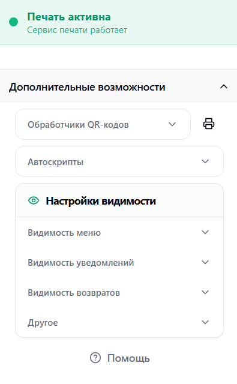
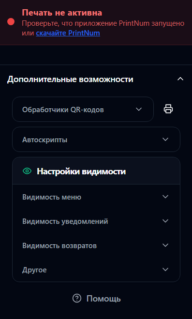

# 🌐 PrintNum Extension

Браузерное расширение для автоматизации работы сотрудников ПВЗ Ozon.

Расширение интегрируется с сайтом `turbo-pvz.ozon.ru` и взаимодействует приложением PrintNum для печати номеров ячеек, а также автоматизирует ряд рутинных операций через QR-коды, автоскрипты и дополнительные инструменты интерфейса.

---

## 📋 Содержание

- [PrintNum Extension](#-printnum-extension)
- [🚀 Быстрый старт](#-быстрый-старт)
- [Возможности](#возможности)
- [Требования](#требования)
- [Использование](#использование)
  - [QR-команды](#qr-команды)
  - [Автоскрипты](#автоскрипты)
  - [Настройки видимости](#настройки-видимости)
- [Архитектура](#архитектура)
- [Внешний вид](#внешний-вид)
- [Стек технологий](#стек-технологий)
- [Структура проекта](#структура-проекта)
- [API взаимодействия](#api-взаимодействия)
- [Разработка](#разработка)
- [Сборка](#сборка)
- [Отладка](#отладка)
- [Авторы](#авторы)

---

## 🚀 Быстрый старт

[(Вернуться к началу)](#-printnum-extension)

> ℹ️ Если вы впервые используете расширение и хотите печатать номера ячеек, сначала необходимо установить и настроить приложение **PrintNum**.

Инструкцию по установке и настройке можно найти в репозитории:

**https://github.com/kirill18734/PrintNum**

> ✅ Без запущенного приложения **PrintNum** функция печати номеров ячеек работать не будет.

---

# Возможности

[(Вернуться к началу)](#-printnum-extension)

## 📦 Автоматизация работы

- Автоматическая отправка номеров ячеек на печать.
- Автоматизация операций через QR-коды.
- Автоматизация упаковки возвратов.

## 🎨 Настройка интерфейса

- Скрытие бокового меню.
- Скрытие уведомлений.
- Скрытие возвратов.
- Скрытие рекламных баннеров.

## 🖨️ Интеграция с PrintNum

- Отправка номеров на печать.
- Проверка состояния сервиса для печати.

---

# Требования

[(Вернуться к началу)](#-printnum-extension)

- Chromium-браузер:
  - Google Chrome
  - Yandex Browser
  - Microsoft Edge
  - Opera

- Firefox (экспериментальная поддержка)

Для разработки:

- Node.js 18+
- npm или pnpm

Для работы расширения:

- Запущенное приложение PrintNum

---

# Использование

[(Вернуться к началу)](#-printnum-extension)

## QR-команды

> ℹ️ Перед использованием QR-кодов их можно распечатать для удобства работы.  
> Файл с QR-кодами можно найти через иконку расширения.

### Выдать заказ (без пакета / M / L)

> ℹ️ Данный скрипт работает только с предоплаченными заказами.

> ℹ️ Если во время выполенения будет заказ, где требуется оплата, либо ануляция, он автоматически остановиться.

Раздел, где сработает QR-код:

```text
Выдача заказов → Открытая карточка для выдачи
```

Выполняет следующие действия:

1. Продолжить
2. Выбор пакета
3. Выдать
4. На главную

---

### Выдать всё (без пакета / M / L)

> ℹ️ Данный скрипт работает только с предоплаченными заказами и закрывает их поочередно один за другим.

> ℹ️ Если во время выполенения будет заказ, где требуется оплата, либо ануляция, он автоматически остановиться.

Раздел, где сработает QR-код:

```text
Выдача заказов
```

Выполняет следующие действия:

1. К выдаче
2. Продолжить
3. Выбор пакета
4. Выдать
5. На главную

---

### Оплатить заказ (без пакета / M / L)

> ℹ️ Данный скрипт работает только с оплаченными заказами.

> ℹ️ Если во время выполенения будет заказ, где НЕ требуется оплата, либо ануляция, он автоматически остановиться.

Раздел, где сработает QR-код:

```text
Выдача заказов → Открытая карточка для выдачи
```

Выполняет следующие действия:

1. Продолжить
2. Выбор пакета
3. Провести оплату
4. На главную

Если оплата не прошла и появилась кнопка:

```text
Попробовать ещё
```

повторное сканирование QR-кода продолжит выполнение сценария.

---

### Отказ от товара

> ℹ️ Скрипт работает стабильно и без ошибок. Однако при аннулировании товара обязательно проверяйте результат визуально: из-за слабого интернет-соединения работа скрипта может прерваться.

Раздел, где сработает QR-код:

```text
Выдача заказов → Открытая карточка для выдачи
```

Как использовать:

1. Отсканируйте товар.
2. В течение 3 секунд отсканируйте QR-код причины возврата.

Выполняет следующие действия:

1. Проверить
2. На проверке
3. К выдаче
4. Изменил решение о покупке/Товар не подошёл

---

### С рекомендацией

Раздел, где сработает QR-код:

```text
Приёмка
```

Выполняет следующие действия:
Автоматически переключает тумблер (флажок / режим)

```text
С рекомендацией
```

---

## Автоскрипты

### Упаковка не требуется

Раздел, где скрипт автоматически активируется:

```text
Отправка → Отправка перевозок → Прямой/Возвратный поток
```

Как использовать:

1. Выберите возврат для упаковки.
2. Отсканируйте товар.
3. Автоматически будет выбрано:
   - «Упаковка не требуется».
4. Отсканируйте новый штрихкод.
5. При появлении кнопки «Завершить» они нажмётся автоматически.
6. Повторно отсканируйте товар с новым штрихкодом.
7. Товар будет добавлен в перевозку.

---

## Настройки видимости

### Меню

> ℹ️ Активируется сразу или при переходе на другую страницу.

Работает на всех страницах.

Позволяет скрыть элементы бокового меню.

### Уведомления

> ℹ️ Активируется сразу или при переходе на другую страницу.

Работает на всех страницах.

Скрывает всплывающие уведомления в правом верхнем углу.

### Возвраты

Раздел, где работает скрытие:

```text
Отправка → Отправка перевозок → Прямой/Возвратный поток
```

Позволяет скрыть определенные возвраты.

### Баннер (Выдача заказов)

> ℹ️ Активируется сразу или при переходе на другую страницу.

Раздел, где работает скрытие:

```text
Выдача заказов
```

Скрывает рекламный баннер.

### Баннер (Открытая карточка выдачи)

> ℹ️ Активируется сразу или при переходе на другую страницу.

Раздел, где работает скрытие:

```text
Выдача заказов → Открытая карточка для выдачи
```

Скрывает рекламный баннер.

---

# Архитектура

[(Вернуться к началу)](#-printnum-extension)

```text
Ozon
 │
 ▼
Content Scripts
 │
 ▼
PrintNum API Client
 │
 ▼
PrintNum Backend
 │
 ▼
Принтер
```

---

# Внешний вид

[(Вернуться к началу)](#-printnum-extension)

<table>
  <thead>
    <tr>
      <th>Светлая тема</th>
      <th>Тёмная тема</th>
    </tr>
  </thead>
  <tbody>
    <tr>
      <td></td>
      <td></td>
    </tr>
  </tbody>
</table>

# Стек технологий

[(Вернуться к началу)](#-printnum-extension)

| Компонент     | Технология   |
| ------------- | ------------ |
| Framework     | WXT          |
| UI            | React 18     |
| Язык          | TypeScript 5 |
| Стили         | Tailwind CSS |
| UI-компоненты | Radix UI     |
| Сборщик       | Vite         |
| Расширение    | WXT          |

---

# Структура проекта

[(Вернуться к началу)](#-printnum-extension)

```text
extension/
├── src/
│   ├── entrypoints/
│   ├── components/
│   ├── hooks/
│   ├── lib/
│   ├── utils/
│   ├── assets/
│   └── public/
│
├── package.json
├── tsconfig.json
├── eslint.config.js
├── tailwind.config.js
├── postcss.config.js
├── wxt.config.ts
└── README.md
```

---

# API взаимодействия

[(Вернуться к началу)](#-printnum-extension)

Базовый URL:

```text
http://127.0.0.1:5000
```

| Метод | Endpoint      | Назначение           |
| ----- | ------------- | -------------------- |
| GET   | /             | Проверка доступности |
| POST  | /print-number | Печать номера        |

Пример:

```javascript
await fetch("http://127.0.0.1:5000/print-number", {
  method: "POST",
  headers: {
    "Content-Type": "application/json",
  },
  body: JSON.stringify({
    number: "123-456",
  }),
});
```

---

# Разработка

[(Вернуться к началу)](#-printnum-extension)

Установка зависимостей:

```bash
npm install
```

или

```bash
pnpm install
```

Запуск режима разработки:

```bash
npm run dev
```

Проверка типов:

```bash
npm run compile
```

---

# Сборка

[(Вернуться к началу)](#-printnum-extension)

Создание production-сборки:

```bash
npm run build
```

После сборки готовое расширение будет находиться в каталоге:

```text
.output/chrome-mv3
```

---

# Отладка

[(Вернуться к началу)](#-printnum-extension)

1. Откройте:

```text
chrome://extensions
```

2. Включите режим разработчика.
3. Откройте инспектор background script.
4. Используйте DevTools на странице Ozon для отладки content scripts.

## Авторы

[(Вернуться к началу)](#-printnum-extension)

- **Кирилл** — Разработчик. По всем вопросам можно связаться в Telegram (@aim_stars)
