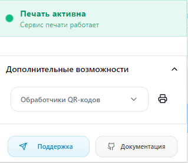
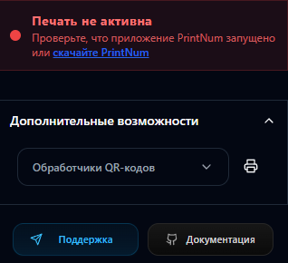

# 🌐 PrintNum Extension

Браузерное расширение для автоматизации работы сотрудников ПВЗ Ozon.

Расширение интегрируется с сайтом `turbo-pvz.ozon.ru`, взаимодействует с приложением PrintNum для печати номеров ячеек и автоматизирует операции выдачи и оплаты заказов с помощью QR-кодов.

---

## 📋 Содержание

- [PrintNum Extension](#-printnum-extension)
- [🚀 Быстрый старт](#-быстрый-старт)
- [Возможности](#возможности)
- [Требования](#требования)
- [Использование](#использование)
  - [QR-команды](#qr-команды)
  - [Автоскрипты](#автоскрипты)
  - [Настройки QR-команд](#настройки-qr-команд)
- [Архитектура](#архитектура)
- [Внешний вид](#внешний-вид)
- [Стек технологий](#стек-технологий)
- [Структура проекта](#структура-проекта)
- [API взаимодействия](#api-взаимодействия)
- [Разработка](#разработка)
- [Сборка](#сборка)
- [Отладка](#отладка)
- [Помощь](#помощь)

---

## 🚀 Быстрый старт

[(Вернуться к началу)](#-printnum-extension)

> ℹ️ Если вы впервые используете расширение и хотите печатать номера ячеек, сначала необходимо установить и настроить приложение **PrintNum**.

Инструкцию по установке и настройке можно найти в репозитории:

**https://github.com/kirill18734/PrintNum**

> ✅ Без запущенного приложения **PrintNum** функция печати номеров ячеек работать не будет.

---

# Возможности

[(Вернуться к началу)](#-printnum-extension)

## 📦 Автоматизация работы

- На странице приёмки расширение отслеживает список номеров ячеек и отправляет на печать первый номер из обновлённого списка.
- QR-команды для выдачи всех заказов или отдельного заказа, оплаты и режима «С рекомендацией».
- Автоматический цикл выбора упаковки: без пакета → M → L.

## ⚙️ Настройка расширения

- Включение и отключение отдельных QR-команд в окне расширения.
- Проверка доступности сервиса печати и переход к скачиванию PrintNum для Windows.
- Открытие PDF-файла с QR-кодами.

## 🖨️ Интеграция с PrintNum

- Отправка номеров на печать.
- Проверка состояния сервиса для печати.

---

# Требования

[(Вернуться к началу)](#-printnum-extension)

- Chromium-браузер:
  - Google Chrome
  - Yandex Browser
  - Microsoft Edge
  - Opera

- Firefox (экспериментальная поддержка)

Для разработки:

- Node.js 18+
- npm или pnpm

Для автоматической печати номеров ячеек:

- Установленное и запущенное приложение PrintNum.

QR-команды работают независимо от приложения PrintNum.

---

# Использование

[(Вернуться к началу)](#-printnum-extension)

## QR-команды

> ℹ️ Перед использованием QR-кодов их можно распечатать для удобства работы.  
> Файл с QR-кодами можно найти через иконку расширения.

### Выдать заказ (без пакета / M / L)

Раздел, где сработает QR-код:

```text
Выдача заказов → Открытая карточка для выдачи
```

Выполняет следующие действия:

1. Для вариантов M и L выбирает соответствующий пакет.
2. Нажимает «Выдать».

Если нужная кнопка не найдена, сценарий прекращает выполнение после ожидания элемента.

---

### Выдать всё (без пакета / M / L)

Раздел, где сработает QR-код:

```text
Выдача заказов
```

Выполняет следующие действия:

1. Нажимает «К выдаче».
2. Для вариантов M и L выбирает соответствующий пакет.
3. Нажимает «Выдать».

Сценарий повторяет действия с паузой в одну секунду, пока они доступны, но не более 50 раз за один запуск.

---

### Оплатить заказ (без пакета / M / L)

Раздел, где сработает QR-код:

```text
Выдача заказов → Открытая карточка для выдачи
```

Выполняет следующие действия:

1. Для вариантов M и L выбирает соответствующий пакет.
2. Нажимает «Провести оплату».

Если оплата не прошла и появилась кнопка:

```text
Попробовать ещё
```

повторное сканирование QR-кода запустит сценарий оплаты ещё раз.

---

### С рекомендацией

Раздел, где сработает QR-код:

```text
Приёмка
```

Выполняет следующие действия:
Автоматически переключает тумблер (флажок / режим)

```text
С рекомендацией
```

## Автоскрипты

Для QR-команд с пометкой «авто» упаковка выбирается по общему циклу:

```text
без пакета → M → L → без пакета → ...
```

Текущий шаг сохраняется в хранилище расширения и используется всеми автоматическими QR-командами.

- **Выдать все (авто)** — повторяет выдачу всех доступных заказов с циклическим выбором упаковки; максимум 50 итераций за один запуск.
- **Выдать заказ (авто)** — выполняет выдачу открытого заказа с очередным вариантом упаковки.
- **Оплатить заказ (авто)** — выполняет оплату открытого заказа с очередным вариантом упаковки.

## Настройки QR-команд

Откройте окно расширения и разверните раздел **«Дополнительные возможности»**. В списке **«Обработчики QR-кодов»** нажмите на команду, чтобы включить или отключить её. Изменения сохраняются в хранилище браузера.

Кнопка с иконкой принтера открывает PDF-файл с QR-кодами. В верхней части окна отображается состояние сервиса печати; если сервис недоступен, оттуда можно перейти к скачиванию установщика PrintNum для Windows.

---

# Архитектура

[(Вернуться к началу)](#-printnum-extension)

```text
Страница Ozon
 │
 ▼
Content Scripts
 ├── QR-команды ───────────────────→ элементы страницы Ozon
 │
 └── Номера ячеек → Background Script → PrintNum API
                                          (http://127.0.0.1:5000)
                                                  │
                                                  ▼
                                      Приложение PrintNum → принтер
```

---

# Внешний вид

[(Вернуться к началу)](#-printnum-extension)

<table>
  <thead>
    <tr>
      <th>Светлая тема</th>
      <th>Тёмная тема</th>
    </tr>
  </thead>
  <tbody>
    <tr>
      <td></td>
      <td></td>
    </tr>
  </tbody>
</table>

# Стек технологий

[(Вернуться к началу)](#-printnum-extension)

| Компонент     | Технология   |
| ------------- | ------------ |
| Framework     | WXT          |
| UI            | React 18     |
| Язык          | TypeScript 5 |
| Стили         | Tailwind CSS |
| UI-компоненты | Radix UI     |
| Сборщик       | Vite         |
| Расширение    | WXT          |

---

# Структура проекта

[(Вернуться к началу)](#-printnum-extension)

```text
extension/
├── src/
│   ├── entrypoints/
│   ├── components/
│   ├── hooks/
│   ├── lib/
│   ├── utils/
│   ├── assets/
│   └── public/
│
├── package.json
├── tsconfig.json
├── eslint.config.js
├── tailwind.config.js
├── postcss.config.js
├── wxt.config.ts
└── README.md
```

---

# API взаимодействия

[(Вернуться к началу)](#-printnum-extension)

Базовый URL:

```text
http://127.0.0.1:5000
```

| Метод | Endpoint      | Назначение                          |
| ----- | ------------- | ----------------------------------- |
| GET   | /             | Проверка доступности сервиса печати |
| POST  | /print-number | Отправка номера ячейки для печати   |

Пример:

```javascript
await fetch("http://127.0.0.1:5000/print-number", {
  method: "POST",
  headers: {
    "Content-Type": "application/json",
  },
  body: JSON.stringify({
    text: "123-456",
  }),
});
```

---

# Разработка

[(Вернуться к началу)](#-printnum-extension)

Установка зависимостей:

```bash
npm install
```

или

```bash
pnpm install
```

Запуск режима разработки:

```bash
npm run dev
```

Проверка типов:

```bash
npm run compile
```

---

# Сборка

[(Вернуться к началу)](#-printnum-extension)

Создание production-сборки:

```bash
npm run build
```

После сборки готовое расширение будет находиться в каталоге:

```text
.output/chrome-mv3
```

Для Firefox используйте `npm run build:firefox` (или `pnpm build:firefox`). Для создания архива доступны команды `npm run zip` и `npm run zip:firefox`.

---

# Отладка

[(Вернуться к началу)](#-printnum-extension)

1. Откройте:

```text
chrome://extensions
```

2. Включите режим разработчика.
3. Откройте инспектор background script.
4. Используйте DevTools на странице Ozon для отладки content scripts.

## Помощь

[(Вернуться к началу)](#-printnum-extension)

- **Telegram:** [@printnum](https://t.me/printnum) — официальный канал PrintNum, где можно получить помощь и следить за обновлениями.
